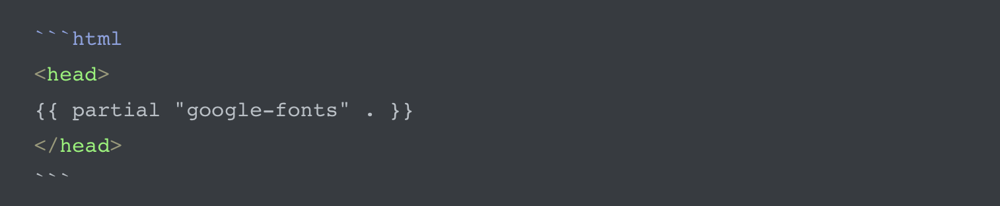
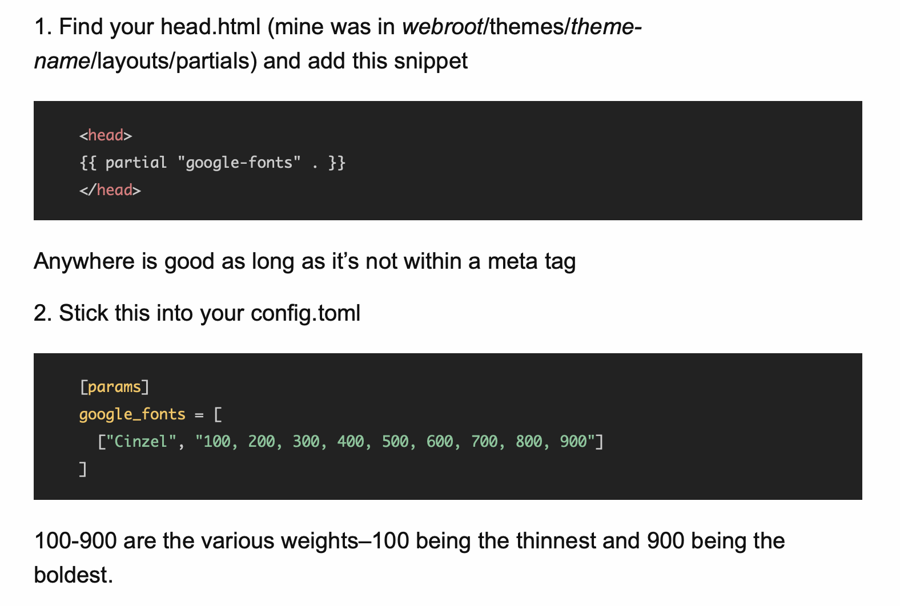

{:.no_toc}

This is a step-by-step guide on how to configure [Prism Syntaxing](https://prismjs.com). The example in this guide is within the [Cupper theme](https://github.com/zwbetz-gh/cupper-hugo-theme) for [hugo server](https://gohugo.io).

Let's get started.

{:toc}

# Tested System

|**Software**   |**Version**   |
|---|---|
|**hugo**   |0.59.0   |
|**Go**   |1.12   |
|**PHP**   |5.6   |
|**ruby**   |2.6.2   |
|**node**   |v10.22.0   |
|**npm**   |v6.14.6   |
|**cupper**   |[Source](https://github.com/zwbetz-gh/cupper-hugo-theme)   |
|**hosting**   |[netlify](https://www.netlify.com)/build 3.3.5  |

# Prerequisites

1. hugo server is running
2. Site is live and running
3. For this example, we are using the [cupper theme](https://github.com/zwbetz-gh/cupper-hugo-theme)

# Instructions

1. Go to the [download page for Prism](https://prismjs.com/download.html#themes=prism-tomorrow&languages=markup+css+clike+javascript)
2. **Compression level**: select Minified version
3. **Themes**: select your own color scheme
4. **Languages**: In other words, what code do you intend on displaying? Choose your languages. For my site, I selected:

   - Markup + HTML + XML + SVG + MathML + SSML + Atom + RSS
   - CSS
   - C-like
   - JavaScript
5. **Plugins**: For my site, I selected "Copy to Clipboard"
6. **Download .js file**: Save the file into the theme/cupper/static/js/ directory
7. **Download .css file**: Save the file into the theme/cupper/static/css/ directory
8. **local hugo server**: Stop and restart hugo
9. **Test page**: Use the following format to use code syntax on your page. Using html, for instance:
   

# Verification

Check your post for the code block and the color syntax for the language you specify.

For example:

   